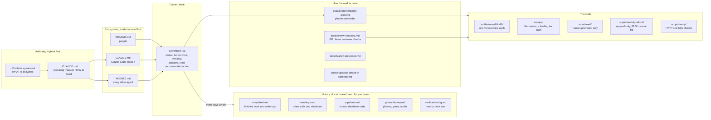
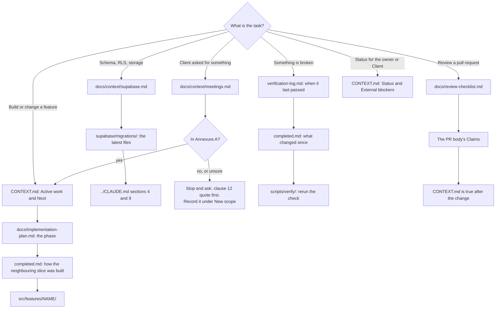
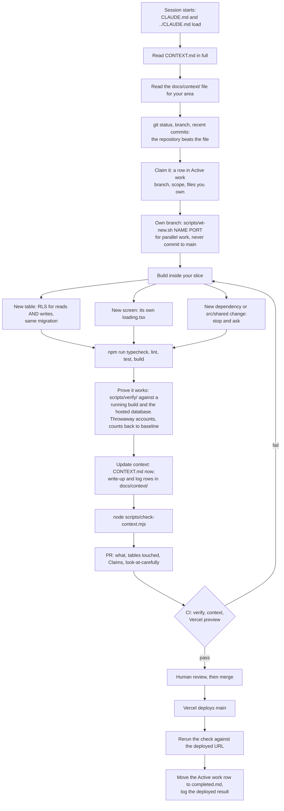
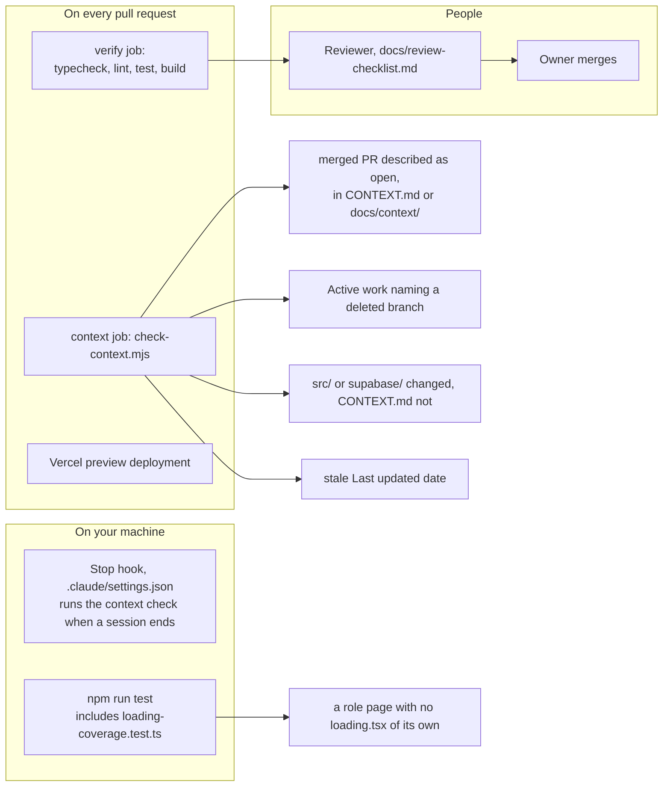

# Agent map

Where to go for what, and the route every piece of work takes from the first read
to the deployed URL. The diagrams render on GitHub; the tables under them say the
same thing in plain text for an agent reading the raw file.

The map shows where things live; it holds no project state. Current state is in
`CONTEXT.md`, and when this map and `CONTEXT.md` disagree, `CONTEXT.md` wins. When
either disagrees with the signed agreement, the agreement wins.

## 1. Where everything lives

| You need | Go to |
|---|---|
| What is in or out of scope, what the Client is owed | `../Context/Two19Labs_Cospire_LMS_V1_Agreement (1).pdf`, then `../CLAUDE.md` section 12 |
| How to build anything: stack, structure, security, testing | `../CLAUDE.md` (the operating manual) |
| What is true right now, who is working on what, what is next | `CONTEXT.md` |
| What a past piece of work did and how it was verified | `docs/context/completed.md` |
| What the Client said or decided in a call | `docs/context/meetings.md`, full transcripts in `../Context/` |
| What is applied to the hosted database, Auth settings, advisors | `docs/context/supabase.md` |
| How a phase, exit gate or security audit went | `docs/context/phase-history.md` |
| The result of any check ever run | `docs/context/verification-log.md` |
| The order phases are built in, and each phase's tests | `docs/implementation-plan.md` |
| What a PR description must contain, what a reviewer checks | `docs/review-checklist.md` |
| A section named somewhere and not found | `grep -rn "<section name>" CONTEXT.md docs/context/` |

## 2. Where do I look? By task

## 3. The route every piece of work takes

| Step | Rule that governs it |
|---|---|
| Read `CONTEXT.md`, then the area's history file | The context rule, in `CLAUDE.md`, `AGENTS.md` and `CONTEXT.md` |
| Claim Active work before the first change | Same rule; check 2 of `scripts/check-context.mjs` fails a claim on a deleted branch |
| Worktrees, ports, one feature each | `../CLAUDE.md` section 5 |
| RLS for writes as well as reads, storage policies per bucket | `../CLAUDE.md` sections 4.3 and 9 |
| A skeleton for every new screen | `CLAUDE.md`, *Every new screen ships with its skeleton* |
| "Should work" is never recorded as "works" | The context rule, and `docs/review-checklist.md` section 4 |
| Schema changes only through migrations, never the Supabase MCP server | `../CLAUDE.md` section 4.5 |

## 4. What enforces it

**What CI does not do:** it never runs anything in `scripts/verify/`. A green
`verify` job means the code compiles and the unit tests pass, not that the
database or the deployed application was checked. Those checks are run by hand,
and their results go in `docs/context/verification-log.md`.
